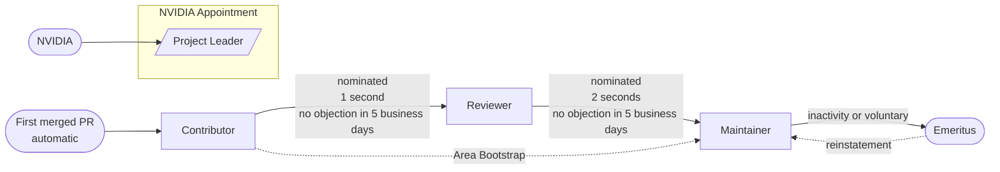

# Topograph Governance

## Scope

This document covers how decisions are made, who holds which roles, and how contributors advance in Topograph. It applies to the upstream repository at https://github.com/dsx-ai-factory/topograph.

---

## Roles and responsibilities

The first three columns are contributor ladder roles — earned through the criteria in the sections below. The diagram below shows how contributors advance through the ladder and how Project Leadership relates to it.

| | Contributor | Reviewer | Maintainer | Project Leader* |
| --- | --- | --- | --- | --- |
| Open issues and PRs | ✅ | ✅ | ✅ | ✅ |
| Comment on PRs | ✅ | ✅ | ✅ | ✅ |
| Formally approve a PR | — | ✅ | ✅ | ✅ |
| Merge a PR | — | — | ✅ | ✅ |
| Triage issues (label, reproduce, link duplicates) | ✅ | ✅ | ✅ | ✅ |
| Close issues | ✅ (own only) | ✅ (routine only) | ✅ | ✅ |
| Propose significant or architectural changes | ✅ | ✅ | ✅ | ✅ |
| Vote on significant or architectural changes | — | — | ✅ | tie-break only |
| Nominate reviewers or maintainers | — | ✅ | ✅ | ✅ |
| Vote on governance decisions | — | — | ✅ | tie-break only |
| Cast deciding vote on ties | — | — | — | ✅ |
| Final authority on decisions that affect IP | — | — | — | ✅ (for NVIDIA) |
| Cut releases | — | — | ✅ | ✅ |

_* Project Leadership is an NVIDIA appointment, not a contributor ladder role. Current Project Leaders are listed in [MAINTAINERS.md](./MAINTAINERS.md)._

A reviewer approval means technical acceptance. The code is correct, the approach is sound, and it meets the quality standards of the project. The maintainer who merges the PR verifies that every commit has DCO sign-off, required CI checks are passing, required approvals are present, and branch protection permits the merge. The maintainer does not review the code again. The two acts answer different questions, and two different people perform them.

A reviewer can close a routine issue, which means a duplicate, an issue that is already fixed, an answered question, or a stale issue. A reviewer must not close an issue that reports an open bug or an unresolved feature request. Anyone can close an issue that they opened.

Architectural changes follow the significant-change process. Any contributor can open a proposal, but only maintainers vote. If a blocking objection stays unresolved, the maintainers vote on it, and the Project Leaders break a tie.

The active maintainer list is in [MAINTAINERS.md](./MAINTAINERS.md). Each entry includes the individual's name, GitHub handle, organizational affiliation, and the areas they own.

**NVIDIA engineers** hold maintainership in their capacity as NVIDIA employees. If an NVIDIA engineer leaves NVIDIA, their maintainer rights end with their employment unless they are re-nominated and approved as an external contributor.

**External contributors** hold maintainership as individuals. Employer clearance is required at appointment. If a maintainer changes employers after appointment, their role is unaffected — any conflict with their new employer's policies is the individual's responsibility to manage.

No single external organization may hold more than 2 external maintainer seats. The maintainers check the cap at appointment only. If a job change puts an organization above 2 seats, no maintainer loses their seat. The maintainers must not appoint another maintainer from that organization until the count returns to 2 or fewer.

All maintainers and Project Leaders must enable two-factor authentication on their GitHub account.

### Scoped maintainers

Projects with distinct subsystems or modules may define scoped maintainers in [CODEOWNERS](./CODEOWNERS). A scoped maintainer has review and merge authority over the paths they own and is expected to review all PRs touching those areas. A project-wide maintainer (listed without a path scope) can merge anywhere.

A scoped maintainer can block a PR that touches the paths they own. A project-wide maintainer must not merge the PR while the objection stands. If the two maintainers cannot agree, either one can raise the question as a significant change, and the decision process below applies.

### Project Leadership

NVIDIA may appoint one or more Project Leaders. The Project Leaders hold the tie-break vote on any deadlocked maintainer decision. NVIDIA holds the authority over decisions that affect IP, which are license changes, project deprecation, and the transfer of the project to a foundation. The Project Leaders use that authority for NVIDIA.

A Project Leader works in the maintainer group with full review and merge rights, but holds the role as part of their work as an NVIDIA engineer, not through the contributor ladder. A Project Leader who leaves NVIDIA also leaves the role. The current Project Leaders are listed in [MAINTAINERS.md](./MAINTAINERS.md).

A Project Leader is an active maintainer, but does not vote in the normal count. The list of eligible voters does not include Project Leaders, so no person votes twice on the same decision. A Project Leader states their position in the discussion before the vote opens, in the same way as any other maintainer.

### Emeritus

A maintainer who steps down or is removed for inactivity is recognized as an Emeritus Maintainer and listed permanently in a dedicated Emeritus section of MAINTAINERS.md.

An emeritus maintainer can ask to return to active status after they resume regular contributions. They post the request as a public GitHub issue or PR. A PR that moves their entry out of the Emeritus section of MAINTAINERS.md counts as the request. The request follows the same rule as a maintainer nomination. It needs **two seconds** from existing maintainers, and no blocking objection within 5 business days. A maintainer who was removed for cause cannot return.

---

## Becoming a contributor

Contributor status is automatic on the first merged pull request. No nomination is required.

---

## Becoming a reviewer

Any contributor may be nominated for reviewer by an existing reviewer or maintainer after demonstrating:

- At least **3 months** of regular participation in the project
- At least **5 merged pull requests** that required real judgment (not typo fixes or automated dependency bumps)
- At least **5 substantive review comments** on other contributors' PRs

The nomination is posted as a public GitHub issue or PR. It requires **one second** from a maintainer. If there are no blocking objections from maintainers within 5 business days, the nomination is accepted.

---

## Becoming a maintainer

Any reviewer or maintainer may nominate a reviewer (or, in exceptional cases, a contributor) for maintainer after they have demonstrated:

- At least **3 months** of sustained contribution since becoming a reviewer, or **6 months** from first contribution for a direct nomination
- At least **10 merged pull requests** of non-trivial scope, of which at least 5 came after becoming a reviewer
- At least **10 substantive code reviews** that improved the quality of the merged PRs, of which at least 5 came after becoming a reviewer
- Familiarity with the project's contribution process, testing requirements, and coding standards
- Reliability: following through on review commitments and responding within expected timeframes

Documentation, issue triage, and community participation count toward the overall picture but do not substitute for code contribution and review.

The nomination is posted as a public GitHub issue or PR. It requires **two seconds** from existing maintainers. If there are no blocking objections from maintainers within 5 business days, the nomination is accepted.

### Area bootstrap

When a new module or subsystem is added to the project and there is no existing contributor base to draw from, the standard tenure and contribution thresholds may be waived for the individual who designed or built that area. An area bootstrap nomination must state explicitly that the standard criteria are not met and why the nominee's domain ownership of the area justifies the exception. It requires **three seconds** from existing maintainers rather than two, and is subject to the same 5-business-day objection window. A bootstrap maintainer must meet the standard criteria within 6 months of their appointment. If they do not, the maintainers review the appointment. The maintainers can extend the period once by 6 months, or move the bootstrap maintainer to Emeritus status.

---

## Inactivity and removal

A maintainer is considered **inactive** if, over any **6 consecutive months**, they have not done any of the following:

- Merged a pull request
- Submitted a substantive review comment on a PR
- Triaged or commented on an issue
- Participated in a governance discussion or vote

Before removal, another maintainer notifies the inactive maintainer privately and allows a **2-week response window**. If there is no response, the maintainer moves to Emeritus status. If they respond and commit to resuming, the current maintainers may agree to extend the window once.

The maintainers can also remove a maintainer for cause, for example a breach of the [Code of Conduct](./CODE_OF_CONDUCT.md). Removal for cause needs a two-thirds supermajority vote of the eligible voters. It does not depend on the inactivity process.

---

## Decision process

### Strategic and operational decisions

Topograph separates decisions into two layers. The layer a decision belongs to determines who decides it and which process applies.

**Operational decisions** run the project day to day. A maintainer, or a reviewer where the table under [Roles and responsibilities](#roles-and-responsibilities) grants the right, decides these individually and in the open, without a proposal and without a vote:

- Reviewing, approving, and merging pull requests
- Triaging, labeling, and closing issues
- Cutting a release under [RELEASE.md](./RELEASE.md), including which ready work lands in a given release
- Bug fixes, dependency version bumps, documentation, tests, and CI changes
- Adding a parameter, label value, or configuration field that leaves every existing contract intact

Any maintainer who thinks an operational decision carries strategic weight escalates it by saying so in the thread and opening the proposal described under [Significant changes](#significant-changes). Escalation needs no second, and work pauses until the proposal resolves.

**Strategic decisions** set the direction of the project and bind every provider, engine, and downstream consumer. The maintainer group decides them collectively through the significant-change process, never a single maintainer acting alone:

- Adding, renaming, or retiring a provider or an engine, including the Helm `provider.name` and `engine.name` values
- Changing the canonical `topology.Graph` or the `Vertex` tree in `pkg/topology/`
- Changing the label contract that downstream projects read, which is `fabric.topograph.run/tier-N`, `accelerator.topograph.run/domain`, and `accelerator.topograph.run/sub-domain`. KAI Scheduler, NVSentinel, and Kueue consume these keys, so a change here breaks software outside this repository.
- Changing the HTTP API surface, which is `/v1/generate`, `/v1/topology`, and `/v1/lookup`, or the schema of `topograph-config.yaml`
- Deprecating or removing anything listed under [Deprecation and end-of-life](#deprecation-and-end-of-life)
- Changing the scope of the project, meaning what Topograph is and is not responsible for discovering
- Changing the release cadence or the contribution model
- Changing this document

**Who holds the strategic layer.** Topograph does not charter a separate steering committee. The maintainers listed in [MAINTAINERS.md](./MAINTAINERS.md), acting collectively and on the public record, are the project's steering group, and the Project Leaders hold the tie-break and the IP authority described under [Project Leadership](#project-leadership). The maintainer group is small enough today to act as one body, and inventing a second body it would fully overlap with would add process without adding a decision. If the group grows past the point where it can hold direction as one, the maintainers can charter a standing steering group and record its membership and remit here, which is a change to this document and therefore itself a strategic decision.

The split is a property of the decision, not of the person. The maintainer who merges a dependency bump in the morning without consulting anyone sits in the strategic layer that afternoon when the group votes on retiring a provider.

### Routine decisions

Routine decisions — bug fixes, minor features, documentation, dependency version bumps — proceed via PR. At least one reviewer or maintainer approval is required for technical acceptance; a maintainer then merges after verifying project requirements are met. The author cannot self-merge.

### Significant changes

Significant changes require a prior proposal before implementation work begins. A change is significant if it involves:

- New features or subsystems
- Breaking changes to APIs or behavior
- Changes to the contribution model, release cadence, or dependency policy, meaning adding or dropping a direct dependency or changing the minimum supported Go version. Bumping an existing dependency to a new version stays operational and needs no proposal.
- Changes to this governance document

A proposal is a GitHub Discussion, design doc, or RFC that explains: what is changing, why, what alternatives were considered, and the impact on existing contributors and users.

**Lazy consensus** governs significant decisions: a proposal open for **5 business days** with no blocking objection from a maintainer is accepted. Silence is consent. A blocking objection must be stated in writing with a specific reason — "I disagree" is not a blocking objection.

If a blocking objection is raised, maintainers discuss until the objection is resolved or withdrawn. If it cannot be resolved, any maintainer may call a vote.

**Voting mechanics.** A maintainer opens the vote as a public issue. Each voter posts their vote in the issue thread, so every vote stays on the public record with the outcome. The voting period is **5 business days**.

**Active maintainers** are all maintainers who are not in Emeritus status. Project Leaders are active maintainers.

**Eligible voters** are the active maintainers who are not Project Leaders, and who did at least one of the actions listed under [Inactivity and removal](#inactivity-and-removal) in the **90 days** before the vote opened. The list of eligible voters is fixed when the vote opens.

Every vote threshold in this document counts against the list of eligible voters. A maintainer who does not vote counts as a vote against, so the project needs no separate quorum rule. The 90-day window keeps that rule fair, because a maintainer who stopped work on the project cannot vote against every proposal by doing nothing.

Silence means consent at the proposal stage, because no vote is open and no list of voters exists. Silence means no once a vote is open, because a maintainer asked for the vote and the list of voters is fixed.

A **simple majority** of eligible voters decides. If the two counts are equal, every Project Leader posts a tie-break vote, and a majority of the Project Leaders decides. If no Project Leader is designated, or if the Project Leaders are equally split, the proposal does not pass.

License changes, project deprecation, and contributing the project to a foundation are decided by NVIDIA regardless of any vote, as these involve IP rights NVIDIA holds as upstream owner. All other decisions — roadmap, architecture, contribution model, release cadence — are governed by the maintainer group.

### Dispute resolution

Most disagreements end in the pull request or the proposal thread. This section covers what happens when one does not, so that no question stalls for want of a rule.

**No individual veto.** No maintainer, reviewer, or Project Leader blocks a change on personal authority alone. A blocking objection stops lazy consensus and sends the question to a vote; it does not decide the question. The one qualified exception is a scoped maintainer's objection on paths they own, under [Scoped maintainers](#scoped-maintainers), which holds only until either party raises the question as a significant change, and which the vote then settles.

**Calling a vote.** Any active maintainer can call a vote once a blocking objection is on the record and discussion has not cleared it. Calling a vote needs no second. The maintainer who calls it opens a public issue that states the exact question, the options a voter can pick, and the list of eligible voters fixed at the moment the vote opens. The voting period is **5 business days**.

**What carries.**

| Decision | Threshold |
| --- | --- |
| Significant or architectural change | Simple majority of eligible voters |
| Contested reviewer or maintainer nomination | Simple majority of eligible voters |
| Appeal of a rejected pull request | Simple majority of eligible voters |
| Removal of a maintainer for cause | Two-thirds supermajority of eligible voters |
| Change to this document | Two-thirds supermajority of eligible voters |

A nomination is contested when a maintainer raises a blocking objection inside the 5-business-day window. It then needs a majority vote in addition to the seconds its nomination type already requires: one for a [reviewer](#becoming-a-reviewer), two for a [maintainer](#becoming-a-maintainer), and three for an [area bootstrap](#area-bootstrap). A maintainer who does not vote counts as a vote against, as set out under [Significant changes](#significant-changes).

**Ties.** A tie is an equal count on each side of the question at the close of the voting period. On a tie, every Project Leader posts a tie-break vote in the same issue, and a majority of the Project Leaders decides. That casting vote is the only one in this project, and no other role holds one.

If no Project Leader is designated, which is the case whenever the Project Leaders section of [MAINTAINERS.md](./MAINTAINERS.md) records none, or if the Project Leaders split evenly among themselves, the tie stands and the proposal does not pass. Failing on a tie is a decision: the change does not land. A proposal that failed on a tie can be reopened at any time once its substance has changed, and reopening it unchanged inside 90 days needs a second from another maintainer.

A supermajority decision cannot tie, because an even split falls short of two-thirds and fails. The tie-break applies only where a simple majority carries.

**Referral of last resort.** A deadlock that the tie-break does not clear, or a dispute the maintainer group cannot settle at all, can be referred to NVIDIA as upstream owner by any maintainer, through a Project Leader when one is designated and through the maintainers listed in [MAINTAINERS.md](./MAINTAINERS.md) otherwise. The referral is made in the public issue or thread that carries the dispute, so the record shows that one was made and what it asked.

On the matters reserved to NVIDIA under [Project Leadership](#project-leadership), which are license changes, project end-of-life, and transfer of the project, NVIDIA decides and the decision binds. A maintainer posts the outcome and the reasoning back to the referring thread.

A proposal to change this document is settled under [Governance changes](#governance-changes), which already states what happens when the maintainers do not reach the two-thirds supermajority. A referral neither displaces that rule nor adds a second outcome to it.

On every matter other than the matters reserved to NVIDIA above and a change to this document, meaning roadmap, architecture, contribution model, release cadence, and anything else this document leaves with the maintainer group, NVIDIA answers with a recommendation and not a ruling. A referral exists to unblock the process, not to reverse a vote that already carried. If the recommendation does not settle the question within **10 business days** of the referral, the referred proposal fails and the current behavior stands, on the same terms as failing on a tie under **Ties** above: the change does not land, the proposal can be reopened at any time once its substance has changed, and reopening it unchanged inside **90 days** needs a second from another maintainer. A dispute that is not a proposal, meaning one about process or working practice rather than a change to the project, closes with the recommendation on the record and nothing in the project changed.

Conduct is not governance. Behavior that breaches the [Code of Conduct](./CODE_OF_CONDUCT.md) goes through the reporting route in that document and is never settled by a vote on the technical merits.

### Architectural decisions

Architectural changes follow this sequence:

1. **Propose** — anyone opens an RFC as a GitHub Discussion or design doc covering what is changing, why, and what alternatives were considered.
2. **Discuss** — open to all; all input is visible and on the record.
3. **Technical review** — reviewers are expected to weigh in with substantive feedback before the decision window closes, not just permitted to.
4. **Decide** — maintainers apply lazy consensus (5 business days). If a blocking objection is raised and cannot be resolved, maintainers vote; simple majority decides with the Project Leaders breaking a tie.
5. **Record** — the outcome and the key reasoning are posted to the RFC thread or the merging PR. A decision that cannot be reconstructed later from public record is not complete.

### Governance changes

A change to this document uses the proposal process for significant changes above. Lazy consensus does not apply. The maintainers always hold a vote, and the change needs a **two-thirds supermajority** of the eligible voters to pass. If the maintainers cannot reach a supermajority, NVIDIA can change this document without a vote.

### PR rejection

A maintainer who closes a PR must state in writing, in the PR thread, the specific reason. "Not a fit" is not sufficient. The explanation must be specific enough that the contributor could address it and resubmit.

A contributor who believes their PR was rejected unfairly may request a second review from any other maintainer, then escalate to the full maintainer group by opening a discussion tagging all maintainers (allow 10 business days for a response). If still unresolved, a simple majority vote of the eligible voters decides.

---

## Deprecation and end-of-life

This section covers retiring part of Topograph. Ending the project as a whole is a separate decision, reserved to NVIDIA, and is covered at the end of this section.

### What counts as a public surface

A surface is public when a user or a downstream project can depend on it without reading the source. These are the public surfaces of Topograph, and each is retired through the process below:

| Surface | Examples |
| --- | --- |
| Provider names registered in `pkg/registry` and the Helm `provider.name` value | `aws`, `crusoe`, `dra`, `gcp`, `infiniband-bm`, `infiniband-k8s`, `lambdai`, `nebius`, `netq`, `nscale`, `oci`, `oci-imds`, and the simulation variants such as `aws-sim` and `dsx-sim` |
| Engine names registered in `pkg/registry` and the Helm `engine.name` value | `slurm`, `k8s`, `nfd`, `slinky`, `graph` |
| Node label and annotation keys | `fabric.topograph.run/tier-N`, `accelerator.topograph.run/domain`, `accelerator.topograph.run/sub-domain`, and the rest of `docs/reference/node-labels.md` |
| HTTP endpoints, request parameters, and response fields | `/v1/generate`, `/v1/topology`, `/v1/lookup` |
| Configuration schema | fields and defaults of `topograph-config.yaml`, including provider parameters and credential keys |
| Helm chart values | keys in `charts/topograph/values.yaml` |
| Published artifacts | the container image and Helm chart named in [RELEASE.md](./RELEASE.md) |

Packages under `internal/`, unexported Go identifiers, test fixtures, and anything the documentation marks experimental where it introduces it are not public surfaces. They can change or disappear in any release. Adding a surface without touching an existing one is not a deprecation and needs no notice.

### What counts as a breaking change

Releases are versioned `vMAJOR.MINOR.PATCH`, as [RELEASE.md](./RELEASE.md) sets out. That document fixes the version format and the release cadence; it does not promise that a breaking change waits for a major version, and the project has not worked that way. What this policy commits to is the notice, the announcement, and the migration path below, and those hold whatever the next version number turns out to be. Naming a change as breaking is what obliges the maintainers to give notice and write the migration note.

A change is breaking when a working deployment stops working after an upgrade with no change on the user's side:

- Removing a provider, engine, endpoint, configuration field, Helm value, or label key
- Renaming any of them, because a rename is a removal plus an addition
- Rejecting a configuration that was previously valid, whether by tightening validation or by narrowing an accepted value
- Changing a default in a way that changes the topology a user already gets
- Changing the meaning of a label value or the shape of an API response while the key or the field name stays the same
- Changing the closest-first ordering of `fabric.topograph.run/tier-N`, where tier 0 is nearest the node

Correcting a defect so that a surface finally behaves as documented is not a breaking change. The `CHANGELOG.md` entry says which of the two it is.

### Deprecation process

1. **Decide.** Deprecating a public surface is a strategic decision and follows the significant-change process. The proposal states what is being retired, why, what replaces it, and what a user has to do to migrate.
2. **Announce.** The release that first ships the deprecation records it in `CHANGELOG.md` under a `### Deprecated` heading in the `[Unreleased]` section, which moves into the version section at release time. The entry names the surface, its replacement, and the earliest release in which removal can happen. The documentation page for the surface says at the top that it is deprecated, updated in the same pull request.
3. **Warn where the user will see it.** A deprecated surface that is reachable at runtime logs a warning naming its replacement when it is used, and a deprecated Helm value renders one through `NOTES.txt`. A runtime warning does not replace the `CHANGELOG.md` entry; a user upgrading through a release should not have to run the code to learn what changed.
4. **Keep it working.** A deprecated surface keeps working unchanged for at least **two minor releases and at least 6 months** after the release that announced it, whichever is longer. At the quarterly cadence in [RELEASE.md](./RELEASE.md), that is roughly two quarters of overlap. The replacement is available and documented on the day the deprecation is announced, so nobody is told to stop using something before there is somewhere to go.
5. **Remove.** Removal happens in a minor or a major release once the notice period in step 4 has elapsed, and never in a patch release, which carries fixes only. The maintainers pick the version bump when they cut the release, weighing how many deployments the removal breaks; nothing here obliges a major bump for every removal. The release records the removal in `CHANGELOG.md` under `### Removed`, points at the release that announced the deprecation, and carries a migration note wherever a user has to change a configuration to keep working, in the form of the Helm migration tables already in the 0.5.0 and v1.0.0 entries. A surface that was never announced as deprecated is not removed. A surface that has never appeared in a tagged release can be withdrawn in the same development cycle that introduced it, because no released version exposed it.

### Shortened notice

Two cases allow a window shorter than step 4. Both take the same maintainer vote as any other strategic decision, and both state the shortened window and the reason in the `CHANGELOG.md` entry.

- **Security.** A surface that cannot keep working without exposing users to a vulnerability can be removed or disabled on whatever timeline the fix requires. Reporting a suspected vulnerability follows [SECURITY.md](./SECURITY.md), which this policy leaves untouched.
- **The upstream source went away.** Providers read external topology sources. When an owner retires one, for example a cloud provider withdrawing the API a provider calls, that provider stops working whatever this document says. The maintainers mark it deprecated in the next release with the reason recorded, and remove it once it can no longer return a topology. A notice period cannot bring back somebody else's API.

### Ending the project

Project-level end-of-life affects IP and is therefore reserved to NVIDIA, as stated under [Project Leadership](#project-leadership) and in [Significant changes](#significant-changes). If NVIDIA ends the project:

- The decision is announced in `README.md`, in `CHANGELOG.md`, and in a pinned GitHub issue at least **6 months** before the repository is archived.
- The announcement says whether the project is unmaintained, transferred to a new owner, or superseded, and names the successor where there is one.
- Released artifacts stay published. Container images and Helm chart packages already released remain available at the locations listed in [RELEASE.md](./RELEASE.md).
- Security fixes for the most recent release continue through the [SECURITY.md](./SECURITY.md) route until the repository is archived.
- The repository is archived read-only rather than deleted, so the history, the issues, and the release record stay reachable.
