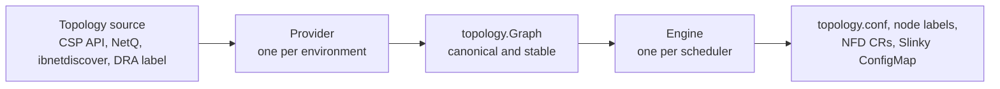

<p align="center">
  <a href="https://github.com/dsx-ai-factory/topograph" target="_blank">
    <picture>
      <source media="(prefers-color-scheme: dark)" srcset="docs/assets/topograph-logo-color-dark.png" />
      
    </picture>
  </a>
</p>

# Topograph

[](https://github.com/dsx-ai-factory/topograph/actions/workflows/go.yml)
[](https://codecov.io/gh/dsx-ai-factory/topograph)
[](https://github.com/dsx-ai-factory/topograph/actions/workflows/chart-test.yaml)
[](https://github.com/dsx-ai-factory/topograph/actions/workflows/k8s-test.yaml)
[](https://github.com/dsx-ai-factory/topograph/releases)
[](https://github.com/dsx-ai-factory/topograph/blob/main/LICENSE)
[](https://docs.nvidia.com/topograph)

Topograph is a component that discovers the physical network topology of a cluster and exposes it to schedulers, enabling topology-aware scheduling decisions. It abstracts multiple topology sources and translates them into the format required by each scheduler.

## Features

- **Fabric discovery.** Multi-tier InfiniBand and Ethernet switch fabric, cloud rack topology, and NVLink accelerator domains, normalized into a single variable-depth hierarchy in which tier 0 is the switch closest to the node.
- **Accelerator domains discovered independently.** Accelerator-domain and sub-domain discovery composes separately from fabric discovery, sourced from `nvidia-smi`, an existing Kubernetes node label, or disabled entirely.
- **A provider per environment.** AWS, Crusoe, GCP, OCI, Nebius, Nscale, Lambda, NVIDIA NetQ, InfiniBand (`ibnetdiscover`, bare metal and Kubernetes), DRA, and a `test` provider that replays simulation models for integration testing.
- **An engine per scheduler.** Slurm `topology.conf` in `topology/tree` or `topology/block` form, Kubernetes node labels, Node Feature Discovery `NodeFeature` and `NodeFeatureGroup` custom resources, Slinky `ConfigMap` output, and a `graph` engine that returns the topology as JSON.
- **API server with request aggregation.** `POST /v1/generate` returns a request ID and `GET /v1/topology` returns the result. Requests arriving inside `requestAggregationDelay` collapse into one topology update, so a scaling burst does not produce a storm of rewrites.
- **Node Observer.** A Kubernetes controller that watches configured node and pod changes plus API-server readiness, coalescing events into one idempotent regeneration.
- **Node Data Broker.** A Kubernetes DaemonSet that collects per-node attributes, such as NVLink clique IDs, and records them as node annotations.
- **Operational surface.** A `/healthz` endpoint and Prometheus `/metrics`, a chart hardened by default to satisfy the Kubernetes `restricted` Pod Security Standard, and optional `Ingress`, `HTTPRoute`, `NetworkPolicy` and `ServiceMonitor` resources.

## Quick Start

### Kubernetes

Requires Kubernetes 1.27 or later, Helm 3.10+ or 4.x, `kubectl` with permission to install a chart and create a namespace, and credentials for whichever provider matches your environment.

```bash
helm repo add topograph https://dsx-ai-factory.github.io/topograph
helm repo update

helm install topograph topograph/topograph \
  --namespace topograph --create-namespace \
  --set provider.name=<provider> \
  --set engine.name=k8s
```

Replace `<provider>` with one of `aws`, `crusoe`, `gcp`, `oci`, `nebius`, `nscale`, `lambdai`, `netq`, `infiniband-k8s`, `dra` or `test`. Provider credentials and parameters are passed as Helm values; the full values shape is in [`charts/topograph/values.yaml`](charts/topograph/values.yaml).

To confirm it worked, run the bundled chart tests, which probe `/healthz` and `/metrics` inside the cluster, then look for the labels the `k8s` engine writes onto nodes a few seconds after install:

```bash
helm test topograph --namespace topograph
kubectl get nodes --show-labels | grep fabric.topograph.run
```

If no labels appear, read the API server logs:

```bash
kubectl logs -n topograph -l app.kubernetes.io/name=topograph
```

Full walkthrough, including the `nfd` and `slinky` engines: [Install on Kubernetes](docs/get-started/quickstart-k8s.md).

### Slurm (bare metal)

Build and install a native package on the Slurm head node. Requires Go and `make` (see [`go.mod`](go.mod) for the Go version), plus the packaging tool for the format you build: `make deb` needs `dpkg-deb` (in the `dpkg` package), and `make rpm` needs `rpmbuild` (in `rpm-build`, which a minimal RHEL, Rocky, or SUSE install does not include). The packaging scripts use GNU `sed` and `readlink` and do not check for their tools up front, so run them on Linux and expect a missing tool to surface as `command not found` after the Go build has already succeeded.

```bash
git clone https://github.com/dsx-ai-factory/topograph.git
cd topograph

make deb                             # Debian / Ubuntu, writes bin/topograph-*.deb
# make rpm                           # RHEL / Rocky / SUSE, writes bin/topograph-*.rpm

sudo dpkg -i bin/topograph-*.deb     # or: sudo rpm -ivh bin/topograph-*.rpm
```

The package installs the service but does not start it. Set at least the provider and engine in `/etc/topograph/topograph-config.yaml`:

```yaml
http:
  port: 49021
provider: aws                        # or gcp, oci, nebius, nscale, netq, infiniband-bm, ...
engine: slurm
requestAggregationDelay: 15s
```

Then start the service and check that the API answers:

```bash
sudo systemctl enable --now topograph.service
curl http://localhost:49021/healthz
```

HTTP 200 means the API server is up. Full walkthrough, including the Slurm trigger that regenerates `topology.conf` when the node inventory changes: [Install on Slurm](docs/get-started/quickstart-slurm.md).

### Without a cloud account

`demos/test-k8s/demo.sh` runs the whole pipeline against simulated nodes in a local kind cluster. It renders KWOK nodes from a model in `tests/models/`, installs the chart with the `test` provider, and prints one node's labels before and after so you can watch the topology land. It prompts before each step. Requires Go, `make`, `docker`, `kind`, `kubectl`, `helm` and `yq`.

```bash
git clone https://github.com/dsx-ai-factory/topograph.git
cd topograph
./demos/test-k8s/demo.sh
```

## Architecture

Topograph has five runtime components:

| Component | Role |
|---|---|
| **API Server** | Receives `/v1/generate` requests, aggregates bursts over `requestAggregationDelay`, and dispatches to the provider |
| **Node Observer** | Kubernetes only. Watches configured node and pod changes plus Topograph API readiness, then triggers regeneration |
| **Node Data Broker** | Kubernetes only. A DaemonSet that collects per-node attributes and stores them as node annotations |
| **Provider** | Per-environment adapter that queries a topology source (CSP API, NetQ, `ibnetdiscover`, DRA labels) and returns the canonical graph |
| **Engine** | Per-scheduler translator that writes the canonical graph out as `topology.conf`, Kubernetes node labels, NFD custom resources, or a Slinky `ConfigMap` |



That split is load-bearing. Providers differ by environment, but the canonical `topology.Graph` they return does not. Engines only translate that graph; they never discover topology themselves. Reading the fabric inside an engine, or emitting scheduler-specific output from a provider, breaks the contract that lets any provider pair with any engine.

Full treatment, including the component and workflow diagrams: [Architecture](docs/architecture.md).

## Why Topograph

Topograph sits between topology sources and schedulers, and replaces neither.

- **Cloud provider topology APIs.** AWS, GCP, OCI, Nebius, Nscale, Crusoe and Lambda each report placement through their own API with its own shape. Topograph wraps those APIs rather than replacing them, and normalizes the result so the scheduler-facing output stays the same when the environment changes.
- **Fabric managers and `ibnetdiscover`.** NVIDIA NetQ and `ibnetdiscover` report the switch fabric as wiring. Topograph queries them as providers and turns that wiring into a scheduling hierarchy.
- **Slurm's topology plugins.** Slurm's `topology/tree` and `topology/block` plugins consume `topology.conf`; they do not discover the fabric. Topograph generates that file, and [`scripts/create-topology-update-script.sh`](scripts/create-topology-update-script.sh) wires up a Slurm trigger that regenerates it when the node inventory changes.
- **Node Feature Discovery.** NFD discovers features that each node can observe about itself. Fabric topology is a relationship between nodes that no single node can see. Topograph's `nfd` engine publishes its topology as `NodeFeature` and `NodeFeatureGroup` custom resources, so NFD-aware consumers can read it through the API they already use.
- **Kubernetes topology-aware schedulers.** [KAI Scheduler](https://github.com/NVIDIA/KAI-Scheduler) and Kueue Topology-Aware Scheduling place pods using node labels, and need something to write those labels. Topograph's `k8s` engine writes `fabric.topograph.run/tier-N` and `accelerator.topograph.run/domain`, described in the [node labels reference](docs/reference/node-labels.md).
- **kubelet Topology Manager.** Topology Manager aligns CPU, GPU and NIC allocations to the same NUMA domain inside a single node. Topograph works at the opposite scope, between nodes. The two are complementary and can run at the same time.

## Distribution

| Artifact | Where it comes from |
|---|---|
| Container image | `ghcr.io/dsx-ai-factory/topograph` |
| Helm chart | [`charts/topograph/`](charts/topograph/) in this repository, published to the chart repository at `https://dsx-ai-factory.github.io/topograph` |
| `.deb` package | `make deb`, written to `bin/` |
| `.rpm` package | `make rpm`, written to `bin/` |

Packaged chart releases and their SHA-256 checksums are also attached to [GitHub Releases](https://github.com/dsx-ai-factory/topograph/releases). To list the chart versions available in the repository, run `helm search repo topograph/topograph --versions`.

## Learn more

- [Overview](docs/overview.md)
- [Architecture](docs/architecture.md)
- [Configuration and API](docs/api.md)

## Community

Ask questions and connect with other users in the
[Topograph community channels](docs/community.md).

Before contributing, read the [contribution guide](CONTRIBUTING.md) and
[Code of Conduct](CODE_OF_CONDUCT.md). For local build/test/lint setup, see
the [Development Guide](DEVELOPMENT.md).

Project roles and decision-making are described in
[Governance](GOVERNANCE.md). See [Maintainers](MAINTAINERS.md) for the current
maintainer list and project leadership status.
