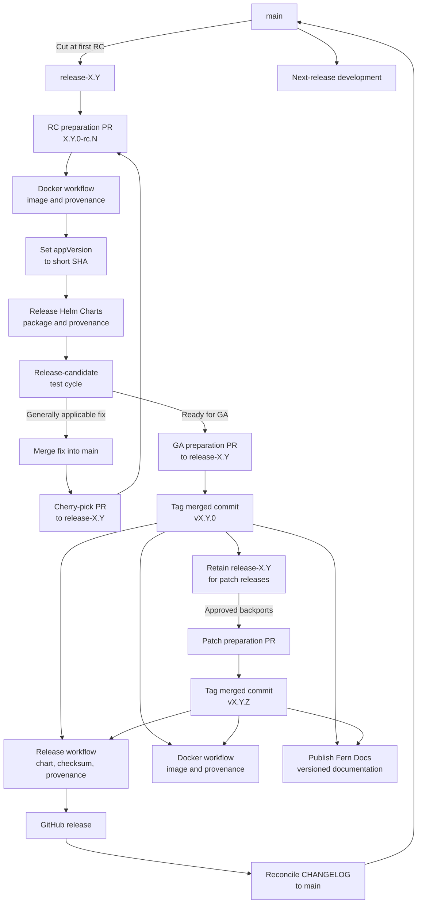

# Release Process

This document outlines the release process for Topograph.

## Release cadence and responsibility

Topograph targets one minor release per calendar quarter. The cadence is
time-based: work that is not ready for a scheduled release moves to a later
release rather than delaying the release solely to include it.

For each release, the active maintainers nominate one active maintainer to
serve as the release person. The nomination should be recorded in the release
tracking issue or another public project record before publication begins.

Only the nominated release person may initiate that release by running the
publication workflows and publishing the GitHub release. If the release person
cannot complete the release, the maintainers nominate a replacement before
another person initiates it.

The active maintainer roster is maintained in [MAINTAINERS.md](./MAINTAINERS.md),
and maintainer release authority is defined in [GOVERNANCE.md](./GOVERNANCE.md).

## Prerequisites

- Nomination as the release person for the release
- Repository write access, including access to GitHub Actions and GitHub Releases
- Understanding of semantic versioning (`vMAJOR.MINOR.PATCH`)
- A clean release commit with all required CI checks passing

## Version management

- Official versions use `vX.Y.Z`, where `X`, `Y`, and `Z` are the major,
  minor, and patch versions.
- Each minor release line has one long-lived branch named `release-X.Y`, such
  as `release-1.2`. Release candidates, the `vX.Y.0` release, and all subsequent
  `vX.Y.Z` patch releases are prepared from that branch.
- Git tags and GitHub releases use the canonical version, such as `v1.2.0` or
  `v1.2.1`; release branches do not include the patch version.
- The Helm chart `version` omits the `v` prefix, while `appVersion` includes it.
  For example, release `v1.2.0` uses `version: "1.2.0"` and
  `appVersion: "v1.2.0"`.
- Release candidates increment the candidate suffix in the Helm chart version,
  such as `1.2.0-rc.1` and `1.2.0-rc.2`, while remaining on `release-1.2`.

This follows the
[Kubernetes release-branch model](https://kubernetes.io/releases/release/):
development continues on `main`, while a `release-X.Y` branch is retained for
stabilization and patch releases.

## Release procedure

### Create and maintain the release branch

Create the release branch from `main` when the changes intended for the first
release candidate have merged. A branch is created only once for a minor
release line; patch releases reuse it.

```bash
git switch main
git pull --ff-only origin main
git switch -c release-1.2
git push -u origin release-1.2
```

After the branch is created:

- New feature development continues on `main`.
- Bug fixes, test fixes, and documentation changes that also apply to future
  releases merge into `main` first, then are cherry-picked through a reviewed
  pull request targeting `release-1.2`.
- Release-specific changes, such as chart and changelog preparation, may be
  submitted directly as a pull request targeting `release-1.2`.
- Do not rebase or force-push the shared release branch, and do not merge the
  release branch back into `main`.

### Prerelease cycle

Prepare every release candidate on the release branch.

1. Confirm that every change intended for the candidate is present on
   `release-1.2` and that required CI checks pass.

2. Create a preparation branch from `release-1.2`. In
   `charts/topograph/Chart.yaml`, set `version` to the release-candidate
   version. Omit the `v` prefix and include the candidate number, such as
   `1.2.0-rc.1`. Leave `appVersion` unchanged for now.

   Run the [quality gates](#quality-gates), commit with DCO sign-off, and open a
   pull request targeting `release-1.2`. Merge it after review and required CI
   checks pass.

3. In GitHub, run the **Docker** workflow against `release-1.2`. The workflow
   publishes the Topograph container image with two tags: the release branch
   name and the short commit SHA. It also generates signed
   SLSA provenance for the image and publishes it to GHCR.

4. Set `appVersion` in `charts/topograph/Chart.yaml` to the short commit SHA
   produced in the previous step. Submit this change through another reviewed
   pull request targeting `release-1.2` and merge it after required CI checks
   pass.

5. Run the **Release Helm Charts** workflow against `release-1.2`. The
   workflow publishes the chart package to the Topograph Helm repository. For
   example, version `1.2.0-rc.1` is published as:

   `https://dsx-ai-factory.github.io/topograph/topograph-1.2.0-rc.1.tgz`

   The workflow also publishes
   `topograph-1.2.0-rc.1.tgz.sha256` beside the chart package and generates
   signed SLSA provenance for the chart package.

6. Run the release-candidate test cycle.

   If testing reveals that generally applicable changes are needed, merge them
   into `main` and cherry-pick them through a pull request to `release-1.2`.
   When the changes for the next candidate are ready, increment the candidate
   number in `Chart.yaml` (for example, from `1.2.0-rc.1` to
   `1.2.0-rc.2`) and repeat steps 1 through 6.

### Official release

Use these steps for both the initial `vX.Y.0` release and later `vX.Y.Z` patch
releases. The release branch must already exist; do not create a version-named
branch for an official release.

1. Confirm that every change intended for the release is present on the
   corresponding release branch and that required CI checks pass. For example,
   release `v1.2.0` and patch release `v1.2.1` both come from `release-1.2`.

2. Create a preparation branch from `release-1.2` and update
   `charts/topograph/Chart.yaml`:

   - Set `version` to the release version without the `v` prefix, such as
     `1.2.0`.
   - Set `appVersion` to the canonical release version, such as `v1.2.0`.

3. Prepare `CHANGELOG.md`:

   - Consolidate the relevant entries and remove redundant intermediate
     entries.
   - Move the released changes from **Unreleased** to a section named
     `## [1.2.0] - YYYY-MM-DD`.
   - Keep an empty **Unreleased** section for future changes.
   - Add or update the comparison link for the release.

4. Run the [quality gates](#quality-gates), commit the changes with DCO
   sign-off, push the preparation branch, and create a pull request targeting
   `release-1.2`.

5. Merge the release pull request after review and required CI checks pass. Do
   not publish official release artifacts from the branch name; the canonical
   tag must identify the exact source commit used to build them.

6. Resolve the current tip of `release-1.2`, then create and push an annotated
   tag that targets that exact commit. First run the script without `--push`
   and inspect the displayed commit:

   ```bash
   scripts/create-release-tag.sh v1.2.0
   ```

   If validation succeeds and the commit is correct, re-run with `--push`. The
   script repeats every validation before it creates and pushes the tag:

   ```bash
   scripts/create-release-tag.sh --push v1.2.0
   ```

7. The tag push automatically starts these workflows:

   - **Release** packages and attests the Helm chart, generates and verifies its
     SHA-256 checksum, publishes both files to the Helm repository, and creates
     the GitHub release with both files attached.
   - **Docker** publishes the multi-architecture container image and its signed
     SLSA provenance.
   - **Publish Fern Docs** publishes the versioned documentation.

8. Complete the [release verification](#release-verification) after all three
   workflows finish successfully.

9. Reconcile the released changelog metadata back to `main` through a focused
   pull request. Copy the new dated release section and comparison link from
   the release branch, and remove only the corresponding released entries from
   **Unreleased** on `main`. Preserve entries added for the next release after
   the release branch was created. Do not merge the release branch into
   `main`.

## Workflow pipeline



The nominated release person manually dispatches **Docker** and **Release Helm
Charts** against `release-X.Y` for release candidates. Pushing an official
`vX.Y.Z` tag from that release line triggers the **Release**, **Docker**, and
**Publish Fern Docs** workflows.

## Released components

An official release publishes:

- A multi-architecture Topograph container image at
  `ghcr.io/dsx-ai-factory/topograph:vX.Y.Z`
- A Helm chart in the Topograph chart repository at
  `https://dsx-ai-factory.github.io/topograph`
- A SHA-256 checksum published beside the Helm chart package
- A GitHub release and source tag named `vX.Y.Z`, with the Helm chart and its
  checksum attached
- Versioned documentation generated from the release tag
- Signed SLSA build provenance for the container image and Helm chart package

## Quality gates

All releases must pass:

- Formatting, vet, lint, and Go tests through `make qualify`
- Helm lint and chart tests through `make chart-test`
- Required GitHub CI checks on the release pull request
- Review of `CHANGELOG.md` for complete, user-facing release notes
- DCO sign-off verification for every commit
- Successful SLSA provenance generation for every published artifact

## Release verification

Verify the published container image:

```bash
docker buildx imagetools inspect ghcr.io/dsx-ai-factory/topograph:v1.2.0
```

Verify the published Helm chart:

```bash
helm repo add topograph https://dsx-ai-factory.github.io/topograph
helm repo update
helm show chart topograph/topograph --version 1.2.0
```

Verify the container image's SLSA provenance:

```bash
gh attestation verify oci://ghcr.io/dsx-ai-factory/topograph:v1.2.0 \
  --repo dsx-ai-factory/topograph \
  --signer-workflow dsx-ai-factory/topograph/.github/workflows/docker.yml \
  --source-ref refs/tags/v1.2.0
```

Download the Helm chart and verify its SLSA provenance:

```bash
curl -fsSLO https://dsx-ai-factory.github.io/topograph/topograph-1.2.0.tgz
curl -fsSLO https://dsx-ai-factory.github.io/topograph/topograph-1.2.0.tgz.sha256
sha256sum --check topograph-1.2.0.tgz.sha256
gh attestation verify topograph-1.2.0.tgz \
  --repo dsx-ai-factory/topograph \
  --signer-workflow dsx-ai-factory/topograph/.github/workflows/release.yml \
  --source-ref refs/tags/v1.2.0
```

Also confirm that:

- The [GitHub release](https://github.com/dsx-ai-factory/topograph/releases) has the
  correct tag, release notes, Helm chart, and checksum.
- The **Docker**, **Release**, and **Publish Fern Docs** workflow
  runs completed successfully.
- The published chart references the expected container image tag.

## Troubleshooting

### Failed container or Helm publication

- Review the failed workflow's logs in GitHub Actions.
- Correct code or configuration through a reviewed pull request to `main`.
- Do not move or replace an existing release tag. If the release itself must be
  corrected, prepare a new patch release.
- To retry the **Release** workflow without changing its provenance context,
  dispatch it from the existing tag:

  ```bash
  gh workflow run release.yml --ref v1.2.0 -f tag=v1.2.0
  ```

- To retry the **Docker** workflow, dispatch it from the same existing tag:

  ```bash
  gh workflow run docker.yml --ref v1.2.0
  ```

### Failed documentation publication

- Review the **Publish Fern Docs** workflow logs.
- Confirm that the tag exists and matches `vX.Y.Z`.
- After correcting the failure, manually dispatch **Publish Fern Docs** with
  the existing tag. Do not create a replacement tag solely to retry the docs
  publication.

### Failed provenance generation

- Review the **Generate SLSA provenance** step in the publishing workflow.
- For container provenance, confirm that the Docker job grants the following:
  `packages: write`, `id-token: write`, `attestations: write`, and
  `artifact-metadata: write`.
- For Helm provenance, confirm that the Helm job grants `id-token: write` and
  `attestations: write`. It does not need `artifact-metadata: write` because the
  chart attestation is stored by GitHub rather than pushed to an OCI registry.
- Retry the failed publishing workflow from the same tag. For **Release**, use
  the tag-bound manual dispatch command shown above so the new attestation still
  names `refs/tags/v1.2.0` as its source.
