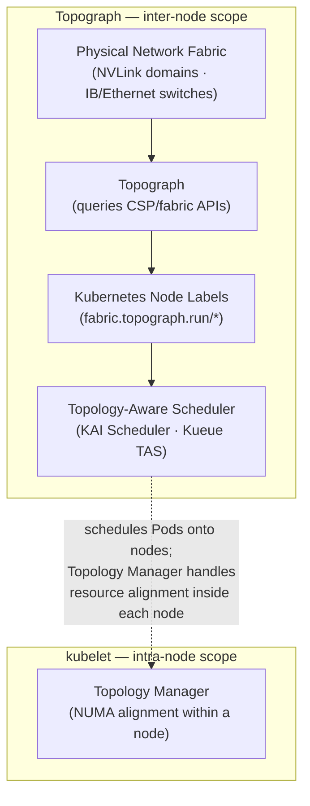

# Topograph in Kubernetes

Topograph is a tool designed to enhance scheduling decisions in Kubernetes clusters by leveraging network topology information.

## Overview

Topograph maps network-fabric locality as a variable-depth label family and
accelerator-network locality as a two-level label hierarchy:

* `fabric.topograph.run/tier-N` identifies fabric switch tiers.
* `accelerator.topograph.run/domain` identifies the accelerator domain.
* `accelerator.topograph.run/sub-domain` identifies an optional accelerator
  sub-domain within that domain.

Fabric tier 0 is closest to the compute node, and tier numbers increase
outwards. Topograph writes only the fabric tiers enabled by the label
configuration. When `acceleratorDomainSourceLabel` is configured and a node
has a non-empty value for that label, the existing label is authoritative and
is not overwritten. The managed accelerator domain and sub-domain labels are
omitted for that node. When the parameter is omitted, provider-supplied
accelerator domains are used and no Kubernetes label receives special
treatment.

The fabric and accelerator-domain label names are configurable via the
[Helm chart](https://github.com/dsx-ai-factory/topograph/tree/main/charts/topograph).
The accelerator sub-domain key is fixed.

For example, if a node belongs to NVLink domain `nvl1`, sub-domain
`nvl1.rack01`, and connects to switch `s1`, which connects to switch `s2`, and
then to switch `s3`, Topograph will apply the following labels to the node:

```
  accelerator.topograph.run/domain: nvl1
  accelerator.topograph.run/sub-domain: nvl1.rack01
  fabric.topograph.run/tier-0: s1
  fabric.topograph.run/tier-1: s2
  fabric.topograph.run/tier-2: s3
```

<p align="center">
  <picture>
    <source media="(prefers-color-scheme: dark)" srcset="../assets/topograph-k8s-community-dark.png" />
    
  </picture>
</p>

### Relationship to the kubelet Topology Manager

Kubernetes includes a [Topology Manager](https://kubernetes.io/docs/tasks/administer-cluster/topology-manager/) (GA since Kubernetes 1.27) that aligns CPU, GPU, and NIC allocations to the same NUMA domain *within a single node*, reducing memory access latency for a Pod's containers. These two features are complementary and address different scopes:

| | Topograph (`k8s` engine) | kubelet Topology Manager |
|---|---|---|
| **Scope** | Inter-node (cluster-wide) | Intra-node (single node) |
| **What it does** | Discovers the physical network fabric and publishes it as node labels | Aligns CPU/device allocations to the same NUMA domain within a node |
| **Consumed by** | Topology-aware schedulers (KAI Scheduler, Kueue TAS) for multi-node placement | The kubelet itself, when binding containers to hardware resources |

Both can be active simultaneously. Topology Manager optimizes resource allocation within a node; Topograph labels tell the scheduler which nodes belong together on the network.



### Using an existing accelerator-domain label

Set `engine.params.acceleratorDomainSourceLabel` when another component already
publishes the accelerator domain as a Kubernetes Node label:

```yaml
engine:
  name: k8s
  params:
    acceleratorDomainSourceLabel: example.com/accelerator-domain
```

For each node with a non-empty value, the k8s engine preserves that label,
removes its managed accelerator domain and sub-domain labels, and continues to
publish all configured fabric tiers. Nodes without the source label use the
provider-supplied accelerator domain and sub-domain. `acceleratorLabel` cannot
be customized when `acceleratorDomainSourceLabel` is set.

There is no default source label. For example, operators who want the NVIDIA
GPU Operator's `nvidia.com/gpu.clique` label to be authoritative must select it
explicitly. Its presence alone has no effect on engine output.

In addition to NVLink domain membership, Topograph provides the full IB switch hierarchy as numbered fabric tiers, giving schedulers both dimensions simultaneously.

For `infiniband-k8s`, operators can set `provider.params.accelerator.source: kubernetes-label` with `kubernetesLabel.key: nvidia.com/gpu.clique` so the provider reads the existing label instead of collecting the same value through a `nvidia-smi` exec in the GPU Operator device-plugin DaemonSet.

## Use of Topograph

While there is currently no fully network-aware scheduler capable of optimally placing groups of pods based on network considerations, Topograph serves as a stepping stone toward developing such a scheduler.

Topograph can be used in conjunction with Kubernetes' existing PodAffinity feature.
This combination enhances pod distribution based on network topology information.

The following excerpt describes a Kubernetes object specification for a cluster with a three-tier network switch hierarchy. The goal is to improve inter-pod communication by assigning pods to nodes within
closer network proximity.

```yaml
    affinity:
      podAffinity:
        preferredDuringSchedulingIgnoredDuringExecution:
          - weight: 70
            podAffinityTerm:
              labelSelector:
                matchExpressions:
                  - key: app
                    operator: In
                    values:
                      - myapp
              topologyKey: fabric.topograph.run/tier-1
          - weight: 90
            podAffinityTerm:
              labelSelector:
                matchExpressions:
                  - key: app
                    operator: In
                    values:
                      - myapp
              topologyKey: fabric.topograph.run/tier-0
```
Pods are prioritized to be placed on nodes sharing the label `fabric.topograph.run/tier-0`.
These nodes are connected to the same network switch, ensuring the lowest latency for communication.

Nodes with the label `fabric.topograph.run/tier-1` are next in priority.
Pods on these nodes will still be relatively close, but with slightly higher latency.

In the three-tier network, all nodes will share the same `fabric.topograph.run/tier-2` label,
so it doesn’t need to be included in pod affinity settings.

Since the default Kubernetes scheduler places one pod at a time, the placement may vary depending on where
the first pod is placed. As a result, each scheduling decision might not be globally optimal.
However, by aligning pod placement with network-aware labels, we can significantly improve inter-pod
communication efficiency within the limitations of the scheduler.

### Mixed Workload Considerations

Topology labels are most valuable when nodes in a topology domain are available for topology-sensitive workloads together. Mixed clusters running both distributed training and topology-insensitive workloads (single-GPU inference, CPU services) present a scheduling challenge: topology-insensitive Pods will consume nodes that could otherwise form complete leaf-switch groups or NVLink domains, forcing training jobs to communicate across additional hops. Schedulers that honor topology labels — such as [KAI Scheduler](https://github.com/NVIDIA/KAI-Scheduler) and Kueue with Topology-Aware Scheduling — can minimize this fragmentation, but only when topology information is available. Topograph's labels are a prerequisite for making these decisions.

## Configuration
Topograph is deployed as a standard Kubernetes application using a [Helm chart](https://github.com/dsx-ai-factory/topograph/tree/main/charts/topograph).
The main chart directly renders the API server, node-observer, and node-data-broker; the component-specific settings remain under `nodeObserver.*` and `nodeDataBroker.*`. When the broker is enabled, the chart passes its name and namespace to the node-observer through `NODE_DATA_BROKER_NAME` and `NODE_DATA_BROKER_NAMESPACE`. The observer waits until the broker DaemonSet's ready replica count matches its desired count before requesting topology generation. When `nodeDataBroker.enabled=false`, those variables are omitted and there is no broker readiness gate.
Topograph is configured using a configuration file stored in a ConfigMap and mounted to the Topograph container at `/etc/topograph/topograph-config.yaml`.
In addition, when sending a topology request, the request payload includes additional parameters.
The provider and engine are defined as top-level Helm values, as shown below:

```yaml
provider:
  # Name of the cloud provider or on-prem environment.
  name: aws
engine:
  name: k8s
  params:
    # Optional closest-first fabric keys and accelerator-domain output key.
    # The sub-domain key remains accelerator.topograph.run/sub-domain.
    # Additional fabric tiers are omitted when the array is configured.
    fabricLabels:
      - example.com/rack
      - example.com/pod
    acceleratorLabel: example.com/nvl-domain

    # Alternatively, use an existing Node label as the accelerator-domain
    # source. Do not set acceleratorLabel when enabling this option.
    # acceleratorDomainSourceLabel: example.com/accelerator-domain

# Shared by supported Kubernetes-backed providers and engines.
kubeClient:
  qps: 50
  burst: 100
```

### Kubernetes API reconciliation and rate limiting

The Kubernetes engine lists the selected Nodes once, reuses that result while
generating output, and compares each Node's existing topology labels with the
desired labels. It skips Nodes that are already current and patches only changed
labels, including removing stale Topograph-managed tier labels. This avoids a
separate Node GET followed by a full Node update for every reconciliation.

Client-go uses default limits of 5 QPS and burst 10. For Helm deployments,
configure the chart-wide `kubeClient.qps` and `kubeClient.burst` values. The
chart exposes them to Topograph as `KUBE_QPS` and `KUBE_BURST`, and the DRA
provider and Kubernetes, NFD, and Slinky engines use the resulting shared
deployment settings. Outside Helm, set the environment variables directly.

A large first reconciliation may still patch many Nodes, so increase the shared
values only when client-side throttling is slowing the update. Higher values
increase Kubernetes API-server load; monitor request latency and HTTP `429`
responses and narrow `nodeSelector` where appropriate.

When the chart manages RBAC, the Topograph API server receives `get`, `list`,
and `patch` access to Nodes for the Kubernetes engine; it no longer requires
Node `update`. Deployments using `rbac.create: false` must grant the same
permissions to the configured ServiceAccount.

## Exposing the Topograph API

The Topograph API server listens on port `49021` by default. The Helm chart always creates a Kubernetes `Service`; how that Service is exposed depends on your deployment topology and access requirements.

**The API server does not implement built-in authentication.** Access controls are always applied at a network layer (`NetworkPolicy`, service mesh, ingress auth, etc.). Deployments that expose the API outside the cluster must add an authentication layer in front of it.

### Access pattern matrix

| Pattern | When to use | Auth story |
|---|---|---|
| `ClusterIP` + `kubectl port-forward` (default) | Local debugging, one-off calls | kubeconfig-based — the user needs K8s API access |
| `ClusterIP` + in-cluster callers | Node Observer calling the API server; downstream schedulers consume node labels directly (no API call needed) | Cluster-internal; lock down with `NetworkPolicy` |
| `NodePort` / `LoadBalancer` | External access without Ingress — simple, but lacks hostname routing and TLS without extra setup | Expect to add an L7 auth layer in front |
| Traditional `Ingress` (`networking.k8s.io/v1`) | Most common production pattern — works with nginx-ingress, Traefik, cloud-managed ingress | Add via ingress auth annotations, oauth2-proxy, or mesh |
| Gateway API (`gateway.networking.k8s.io/v1` `HTTPRoute`) | Newer clusters running a Gateway API implementation (kgateway, Cilium, Istio, Envoy Gateway, Nginx Gateway Fabric, etc.); role-oriented separation between platform-owned `Gateway` and workload-owned `HTTPRoute`; cross-namespace routing via `ReferenceGrant` | Attach implementation-specific policy (kgateway `TrafficPolicy`, Istio `RequestAuthentication`, Envoy Gateway `SecurityPolicy`, Nginx Gateway Fabric `ClientSettingsPolicy`, Cilium L7) to the rendered `HTTPRoute` via `targetRefs` |

### Default: ClusterIP

By default, `service.type: ClusterIP` and `ingress.enabled: false`. This means:

- The API is not exposed outside the cluster
- In-cluster components (Node Observer, Node Data Broker) reach the API via the Service DNS name `<release>-topograph.<namespace>.svc.cluster.local:49021` by default
- Cluster operators can reach the API via port-forward for debugging:

```bash
kubectl -n <namespace> port-forward svc/<release>-topograph 49021:49021
curl http://localhost:49021/healthz
```

The Service name is `<release>-topograph` by default (rendered from the chart's `fullname` template); substitute your Helm release name and the namespace you deployed it into.

This is the recommended pattern for production deployments where Topograph is consumed only by in-cluster callers.

### Exposing via Ingress

Enable the bundled Ingress template:

```yaml
# values.yaml
ingress:
  enabled: true
  className: nginx
  hosts:
    - host: topograph.example.com
      paths:
        - path: /
          pathType: Prefix
  tls:
    - hosts:
        - topograph.example.com
      secretName: topograph-tls
```

Authentication must be added at the Ingress or mesh layer. Common patterns:

- nginx-ingress `nginx.ingress.kubernetes.io/auth-url` + oauth2-proxy
- Istio `RequestAuthentication` + `AuthorizationPolicy`
- mTLS termination at the ingress with client certificate validation

### Exposing via Gateway API (`HTTPRoute`)

The chart ships an optional `HTTPRoute` template (`charts/topograph/templates/httproute.yaml`) that attaches to an existing platform-owned `Gateway`. Enable with:

```yaml
# values.yaml
gatewayAPI:
  enabled: true
  parentRefs:
    - name: topograph-gateway
      namespace: gateway-system
  hostnames:
    - topograph.example.com
```

**Mutually exclusive with `ingress.enabled`.** The chart refuses to render if both are enabled — deploying both routing resources against the same Service is almost always a misconfiguration.

A complete example values file is provided at `charts/topograph/values.k8s.gateway-api-example.yaml`.

**Prerequisites** (operator responsibility, outside this chart):

1. **Gateway API CRDs installed** in the cluster — standard channel `gateway.networking.k8s.io/v1`. The chart fails cleanly with a clear error if they are absent.
2. **A Gateway API implementation running** — kgateway, Cilium, Istio, Envoy Gateway, Nginx Gateway Fabric, or any other conformant implementation. The chart's `HTTPRoute` uses only standard `gateway.networking.k8s.io/v1` fields with no implementation-specific annotations, so it is portable across any of them.
3. **A `Gateway` resource provisioned** with a listener this `HTTPRoute` can attach to. The chart does **not** author `Gateway` or `GatewayClass` resources — both are platform-owned.
4. **A `ReferenceGrant`** in the Gateway's namespace if it lives in a different namespace from the release, per Gateway API cross-namespace attachment rules.

**Default routing.** If `gatewayAPI.rules` is empty, the chart emits a single catch-all rule routing all requests to the Topograph Service (which serves `/v1/generate`, `/v1/topology`, `/v1/lookup`, `/healthz`, and `/metrics` on a single port). Override `gatewayAPI.rules` to provide path-specific matching — for example, to expose only `/v1/`:

```yaml
gatewayAPI:
  enabled: true
  parentRefs:
    - name: topograph-gateway
      namespace: gateway-system
  rules:
    - matches:
        - path:
            type: PathPrefix
            value: /v1/
      backendRefs:
        - name: topograph
          port: 49021
```

**Authentication.** Topograph's binary has no built-in authentication on any endpoint, including `/v1/generate` and `/v1/lookup`. When exposing the API externally, enforce authentication at the Gateway layer via the implementation's policy mechanism (kgateway `TrafficPolicy` + ExtAuth, Istio `RequestAuthentication`, Envoy Gateway `SecurityPolicy`, Nginx Gateway Fabric `ClientSettingsPolicy`, Cilium L7). These attach to the rendered `HTTPRoute` via `targetRefs` (or equivalent) as separate resources — no chart changes required. See `values.k8s.gateway-api-example.yaml` for a concrete kgateway example.

**GRPCRoute, TLSRoute, BackendTLSPolicy** are not supported in this chart. Topograph's API is HTTP-only; TLS termination (when needed) happens at the Gateway listener.

### Metrics endpoint

The `/metrics` endpoint exposes Prometheus metrics on the same port. Enable the bundled `ServiceMonitor` for Prometheus Operator scraping:

```yaml
serviceMonitor:
  enabled: true
```

This creates a `monitoring.coreos.com/v1` `ServiceMonitor` selecting the Topograph Service.

### Pod security context

The chart applies a hardened security context to all three components (API server, node-observer, node-data-broker) by default, satisfying the Kubernetes [`restricted` Pod Security Standard](https://kubernetes.io/docs/concepts/security/pod-security-standards/): non-root execution (`runAsNonRoot`, UID/GID `65532`), `seccompProfile: RuntimeDefault`, `allowPrivilegeEscalation: false`, a read-only root filesystem, and all Linux capabilities dropped. The Kubernetes, NFD, and Slinky engines write Kubernetes resources through the API server and never write to the container filesystem, so these defaults require no additional configuration.

Override individual keys to relax the defaults where a workload needs it; a per-key override wins over the shipped default. Two cases need it:

- **InfiniBand discovery.** The `infiniband-k8s` broker reads `/sys/class` and must run `privileged` as root. `values.k8s.ib-example.yaml` is the built-in example. **Supply a *complete* override, not a partial one:** because Helm deep-merges values, setting only `securityContext.privileged: true` leaves the default `allowPrivilegeEscalation: false`, and the API server rejects `privileged: true` + `allowPrivilegeEscalation: false` at admission. The example therefore also sets `allowPrivilegeEscalation: true`, `readOnlyRootFilesystem: false`, and `runAsNonRoot: false` on the broker. Override only that component — keep the API server and node-observer hardened. (`infiniband-k8s` needs **no** exception for Topograph's own container: it execs into GPU Operator pods, and Topograph's container stays hardened.)
- **`slurm` / `graph` engines in-cluster.** These engines write a `topology.conf` file to their configured output path, so they need `securityContext.readOnlyRootFilesystem: false` plus a writable volume mounted at that path. The default `k8s` and `slinky` engines are API-only and need no such change.

When you additionally **enforce** the standard on the release namespace (`pod-security.kubernetes.io/enforce: restricted`), the hardened default workloads pass admission, but two shapes are rejected and need attention:

- **The `infiniband-k8s` broker.** Its required `privileged: true` override (above) is incompatible with the `restricted` standard, so the broker `DaemonSet` is rejected in a namespace that enforces it. Run the broker in a namespace that does not enforce `restricted` (for example `pod-security.kubernetes.io/enforce: baseline` or `privileged`), or leave the Topograph namespace unenforced when using InfiniBand discovery.
- **User-supplied `initContainers`.** Init containers added through the `initContainers` value render with no container-level security context. The pod-level defaults (`runAsNonRoot`, `seccompProfile`) are inherited, but the container-level controls (`allowPrivilegeEscalation: false`, dropped capabilities) are not — so an unconstrained init container is rejected under `restricted`. Give any init container you add its own `restricted`-compliant `securityContext`.

### NetworkPolicy

The chart ships an opt-in `NetworkPolicy` covering **all three components** (API server, node-observer, node-data-broker), off by default:

```yaml
networkPolicy:
  enabled: true
```

The policy selects every pod in the release by the `app.kubernetes.io/instance` label. When enabled, ingress is denied except:

- **intra-release traffic** — so the node-observer can reach the API server to trigger regeneration, and
- the **metrics scraper namespace** (`networkPolicy.metricsScraperNamespace`) when set.

`serviceMonitor.namespace` is where the `ServiceMonitor` CR lives — it is not necessarily where Prometheus runs. Set `networkPolicy.metricsScraperNamespace` to the namespace that the Prometheus pod (or other scraper) actually runs in:

```yaml
networkPolicy:
  enabled: true
  metricsScraperNamespace: prometheus-system
```

**Ingress and Gateway API controllers.** If you enable `ingress.enabled` or `gatewayAPI.enabled` alongside the NetworkPolicy, the ingress or gateway controller pod (which runs in its own namespace) will be blocked. Add an `extraIngress` rule for the controller namespace:

```yaml
networkPolicy:
  enabled: true
  extraIngress:
    - from:
        - namespaceSelector:
            matchLabels:
              kubernetes.io/metadata.name: ingress-nginx   # adjust to your controller namespace
      ports:
        - protocol: TCP
          port: 49021
```

**Egress stays unconstrained until you set `extraEgress`.** Adding an egress rule to a pod turns on default-deny egress for it, so enabling the policy does *not* add an `Egress` policyType by itself — that would break egress on clusters without a default-deny. When you set `extraEgress` (i.e. you *do* run default-deny egress), the chart adds an `Egress` policyType with a **DNS** allow, an **intra-release** allow (observer→API), and then your rules.

Because a portable chart cannot know your cluster's API-server address or your provider's topology-source endpoint, those egress targets are operator-supplied — and on a default-deny-egress cluster they are **required** (all three components call the Kubernetes API server; the API server calls the provider):

```yaml
networkPolicy:
  enabled: true
  extraEgress:
    # Kubernetes API server. Which IP and port to use depends on whether your
    # CNI evaluates NetworkPolicy before or after kube-proxy DNAT:
    #   Service IP  (kubectl get svc kubernetes -n default)  → port 443
    #   Endpoint IP (kubectl get endpoints kubernetes -n default) → port 6443
    # The Service IP + 443 path is most common for in-cluster client-go:
    - to:
        - ipBlock:
            cidr: 10.96.0.1/32
      ports:
        - protocol: TCP
          port: 443
    # Provider topology source (e.g. the BCM management endpoint):
    - to:
        - ipBlock:
            cidr: 10.0.0.0/24
      ports:
        - protocol: TCP
          port: 8081
```

`extraIngress` similarly appends custom ingress rules. **Give every `extraIngress`/`extraEgress` entry explicit `to`/`from`/`ports`** — an empty rule object (`{}`) matches *all* traffic in that direction, which defeats the default-deny. Note that a NetworkPolicy has no effect unless your CNI enforces it (Calico, Cilium, etc.).

The DNS allow rule is scoped to the standard `k8s-app: kube-dns` pod label. If your cluster's CoreDNS carries a different label, override `networkPolicy.dnsPodSelector` so DNS resolution isn't blocked:

```yaml
networkPolicy:
  enabled: true
  dnsPodSelector:
    app.kubernetes.io/name: coredns
```

**Per-provider egress.** Kubernetes NetworkPolicy egress cannot target hostnames — only `ipBlock`, selectors, and ports — so a provider's endpoint must be supplied as an `ipBlock` (resolve the hostname to its IP/CIDR). Typical `extraEgress` targets by provider:

| Provider(s) | `extraEgress` target |
|---|---|
| all (under default-deny) | kube-apiserver Service IP on `443` or endpoint IP on `6443` (see above) |
| `netq` | the NetQ server IP (resolve the `apiUrl` host) on its port (`443` by default) |
| BCM (planned) | the BCM head-node CIDR on `8081` |
| `aws`, `gcp`, `oci`, `nebius`, `nscale`, `lambdai`, `cw` | the cloud API over `443`; if the provider reads instance metadata, `169.254.169.254/32` — **IMDS access is a credential-exposure vector**, so scope it tightly and prefer workload identity where the provider supports it |
| `dra`, `infiniband-k8s` | none beyond the kube-apiserver + DNS (they operate in-cluster) |

> **On NMC / Calico clusters** the tenant baseline is a cluster-wide Calico `GlobalNetworkPolicy` default-deny that already allows kube-apiserver and DNS egress and governs intra-tenant traffic by namespace-list membership. There, prefer adding the Topograph namespace to the NMC network-policy `user.namespaceList` (and the BCM CIDR to `bcmHeadNodeCidrs`) rather than this chart policy; this `networkPolicy` is aimed at clusters that expect each workload to ship its own default-deny allow-rules.

### Node Observer RBAC

The node-observer `ClusterRole` grants `pods [list, watch]` unconditionally, `apps/daemonsets [list, watch]` when `nodeDataBroker.enabled=true`, and `nodes [list, watch]` only when `nodeObserver.topograph.trigger.nodeSelector` is set. Set `nodeObserver.rbac.create: false` to suppress the `ClusterRole`/`ClusterRoleBinding` when managing RBAC externally.

When reusing an existing ServiceAccount for Topograph, node-observer, or
node-data-broker, set the component's `serviceAccount.create` value to `false`
and provide `serviceAccount.name`. The chart rejects an empty name rather than
silently binding cluster-scoped permissions to the namespace's default
ServiceAccount. To use that account intentionally, set `name: default`.

### Node Data Broker write-scoping via ValidatingAdmissionPolicy

The node-data-broker's RBAC grants update permission on nodes cluster-wide. To enforce least-privilege scoping, the chart supports deploying an opt-in `ValidatingAdmissionPolicy` and its binding:

```yaml
nodeDataBroker:
  validatingAdmissionPolicy:
    enabled: true
```

When enabled, the policy matches node `UPDATE` operations performed by the broker's ServiceAccount and validates that the name of the node being modified matches the node name claim bound to the requester's ServiceAccount token (`authentication.kubernetes.io/node-name`).

**Prerequisites:**
1. A Kubernetes cluster running **Kubernetes 1.30+** with the **`ValidatingAdmissionPolicy` API enabled** (`admissionregistration.k8s.io/v1`).
2. ServiceAccount tokens carrying the node-binding identity claim (e.g., via `ServiceAccountTokenPodNodeInfo`). The policy denies updates from the broker ServiceAccount if this required node-name claim is missing from the request context.

## Validation and Testing

The Helm chart ships two layers of validation for operators.

### Schema-backed values validation at install time

`charts/topograph/values.schema.json` is a JSON Schema that Helm enforces during `helm template` and `helm install`. Misspelled provider names, wrong engine enums, out-of-range replica counts, bad pull policies, invalid service port numbers, and malformed `serviceMonitor` / `tests` / `ingress` shapes are rejected with a clear `at '/field/path': <explanation>` error before any template rendering happens. For example, `--set engine.name=bogus` produces:

```
Error: values don't meet the specifications of the schema(s) in the following chart(s):
topograph:
- at '/engine/name': value must be one of 'graph', 'k8s', 'nfd', 'slinky', 'slurm'
```

The schema is deliberately narrow: per-provider credential requirements are documented in prose in `docs/providers/<name>.md` rather than enforced in the schema, because credential field sets evolve with upstream provider changes.

### `helm test` hooks

The chart ships two `helm test` hook pods (`charts/topograph/templates/tests/`) that probe the running Topograph API via its in-cluster Service after install:

- **`test-healthz`** — `GET /healthz`; expects HTTP 200 (liveness check).
- **`test-metrics`** — `GET /metrics`; expects HTTP 200 and the `topograph_version` Prometheus metric present in the response body (topograph-specific identity check; distinguishes topograph from any other service that might return 200).

Run the suite after installation:

```bash
helm repo add topograph https://dsx-ai-factory.github.io/topograph
helm repo update
helm install topograph topograph/topograph \
  --namespace topograph --create-namespace
helm test topograph --namespace topograph
```

Expected output:

```
TEST SUITE:     topograph-test-healthz
Phase:          Succeeded
TEST SUITE:     topograph-test-metrics
Phase:          Succeeded
```

Both pods clean themselves up on success (`helm.sh/hook-delete-policy: before-hook-creation,hook-succeeded`). On failure the pods persist so operators can inspect logs via `kubectl logs -n <ns> <pod-name>`; the next `helm test` invocation replaces the prior pods.

**Air-gapped environments.** The test pods reuse the main topograph image by default — they invoke `busybox wget` from the Alpine-based `ghcr.io/dsx-ai-factory/topograph` image already pulled by the Deployment. No additional image pull is required by `helm test`, so the suite works in environments where only mirrored images are reachable. If your mirrored image lacks `busybox wget`, override the test image:

```yaml
tests:
  image:
    repository: my-registry.internal/wget
    tag: v1.0.0
```

or disable the test hooks entirely:

```yaml
tests:
  enabled: false
```

### Chart README

For installation, prerequisites, values reference, and configuration examples, see [`charts/topograph/README.md`](../../charts/topograph/README.md) — also surfaced via `helm show readme topograph/topograph`.
